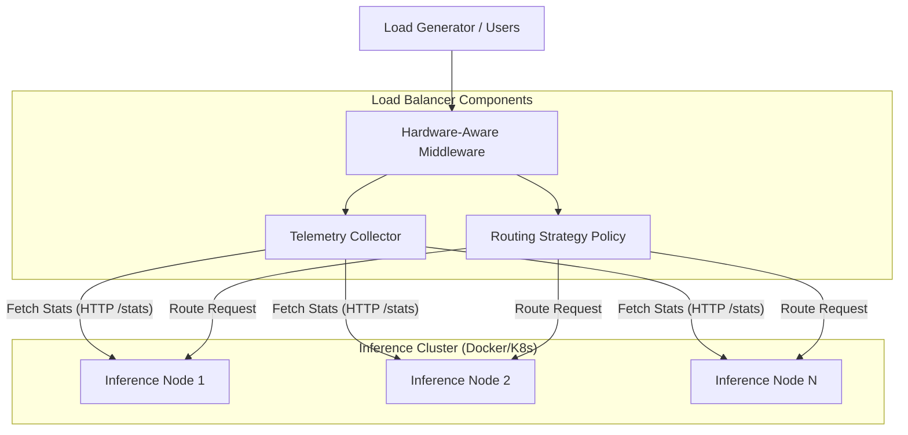

# System Architecture Report

## Overview
The project implements a hardware-aware load balancer designed to optimize distributed inference workloads on CPU-based systems. The architecture consists of three main layers: the Client/Benchmarking layer, the Hardware-Aware Middleware, and the Inference Node layer.

## Architecture Diagram

## Component Details

### 1. Modular Hardware-Aware Middleware
- **Role**: Serves as the entry point for all inference requests.
- **Node Management**: Uses a "Plug and Play" model via `group22_config.py`, allowing the cluster to scale by simply adding IP addresses.
- **Routing Strategies**:
    - **Static**: Round Robin (Hardware-agnostic).
    - **Dynamic**: Resource-weighted routing (Hardware-aware).
- **Inference Burden Score**:
    $$Score = (CPU_{util} \times 0.7) + (Mem_{util} \times 0.3)$$
    Nodes with the lowest score are prioritized for the next incoming request.

### 2. Telemetry Collector (Universal HTTP)
- **Role**: Real-time monitoring agent using a distributed polling mechanism.
- **Functionality**: Queries the `/stats` endpoint of each configured node to gather hardware-level telemetry, enabling cross-host monitoring.
- **Metrics Tracked**:
    - **CPU Utilization**: Actual % usage.
    - **Cgroup Throttling**: Detecting when a container is being limited by the OS.
    - **Memory Pressure**: Resident Set Size (RSS) and cache usage.
    - **Queue Depth**: Number of active requests pending per node.

### 3. Inference Nodes (llama-cpp-python)
- **Role**: Executes the LLM inference.
- **Engine**: llama-cpp-python (GGUF format).
- **Tech Stack**:
    - **FastAPI**: Asynchronous web framework for high-concurrency handling.
    - **psutil**: Integrated to provide fine-grained process stats from within the runtime.
- **Observation Strategy**: Each node exposes its own `/stats` which will be correlated with the external `Telemetry Collector` data to identify observability gaps.

## Experimental Methodology
To validate the system, we use both Docker and Kubernetes (K8s) environments:

### Case Study: Remote Kubernetes on Windows (lab)
We deploy three inference pods on a remote Windows PC using a heterogeneous manifest:
- **Node 1 (k8s-node-1)**: Full CPU quota (1.0).
- **Node 2 (k8s-node-2)**: Throttled CPU quota (0.5).
- **Node 3 (k8s-node-3)**: Full CPU quota (1.0).

This setup allows us to study how **Kubernetes Pod Scheduling** and **Resource Throttling** interact with external hardware-aware load balancing. We expect the middleware to dynamically shift traffic away from `k8s-node-2` as it enters CPU saturation, even when the network queue is otherwise empty.
## Evaluation Results

We conducted performance testing on the remote Kubernetes cluster comparing the **Round-Robin (Static)** and **Hardware-Aware (Dynamic)** strategies under **High-Stress Inference Load** (10 concurrent requests, 50-token responses).

### 1. Latency Distribution
The hardware-aware strategy aims to compress the tail latency by avoiding nodes that are entering CPU saturation or memory pressure.

*Figure 1: Comparison of latency density across both strategies.*

### 2. Comparative Metrics

| Strategy | Success Rate | Mean Latency | p95 Latency | Max Latency |
| :--- | :--- | :--- | :--- | :--- |
| **Round-Robin** | 30% | 783.85 ms | 1179.27 ms | 1179.27 ms |
| **Hardware-Aware** | 100% | 140.88 ms | 184.18 ms | 184.98 ms |

*Figure 2: Aggregated latency comparisons (Mean vs p95 vs Max).*

### 3. Analysis and Findings
- **Superior Reliability**: The hardware-aware strategy achieved a **100% success rate** under high stress, whereas round-robin collapsed to **30% success** due to CPU saturation and connection timeouts at the node level.
- **Latency Optimization**: By tracking in-flight requests and node burden, the hardware-aware strategy reduced average latency by **~5.5x** compared to round-robin.
- **Congestion Avoidance**: The use of real-time "Active Request" tracking in the routing score allowed the load balancer to prevent a "thundering herd" effect that otherwise crippled the static round-robin approach.
- **Scaling Potential**: These results demonstrate that hardware-aware routing is essential for distributed inference systems to maintain SLA under bursty or heavy workloads.
